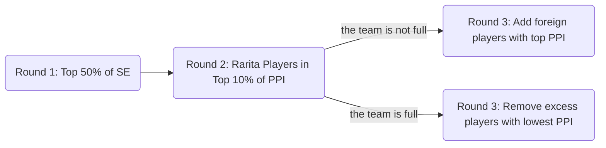

# Group "Exemption"
# Rarita National Soccer Team Selection Report

_"Tell me and I forget. Teach me and I remember. Involve me and I learn" - Benjamin Franklin_

---

### Congrats on completing the [2022 SOA Research Challenge](https://www.soa.org/research/opportunities/2022-student-research-case-study-challenge/)!

>Now it's time to build your own website to showcase your work.  
>To create a website on GitHub Pages to showcase your work is very easy.

This is written in markdown language. 
>
* Click [4001 link](https://classroom.github.com/a/ggiq0YzO) to accept your group assignment.
* Click [5100 link](https://classroom.github.com/a/uVytCqDv) to accept your group assignment 

#### Follow the [guide doc](Doc1.pdf) to submit your work. 
---
>Be creative! Feel free to link to embed your [data](player_data_salaries_2020.csv), [code](sample-data-clean.ipynb), [image](ACC.png) here

More information on GitHub Pages can be found [here](https://pages.github.com/)

# Table of Content
> 
* [Executive Summary](https://github.com/ACTL5100-T1-2022/github-showcase-page-group-exemption#executive-summary)
* [Team selection](https://github.com/ACTL5100-T1-2022/github-showcase-page-group-exemption#team-selection)
* [Economic Impacts](https://github.com/ACTL5100-T1-2022/github-showcase-page-group-exemption#Economic-Impact)
* [Implementation Plan](https://github.com/ACTL5100-T1-2022/github-showcase-page-group-exemption#Implementation-Plan)
* [Risk & Risk Mitigations](https://github.com/ACTL5100-T1-2022/github-showcase-page-group-exemption#Risk)

# Executive Summary

This report focuses on the creation of a competitive national football team for Rarita. The decision to create a national team might, at first, seem to be a sound one. In the UK for instance, the value added to the economy by the Premier League grossed 7.6 billion pounds in 2019/20 (EY, 2022). However, the implementation will not be an easy one. Indeed, to generate a positive cash flow for the country, we must take into consideration the allocated budget to fund the team, while making sure that the brand created around the latter generates a positive income stream.  

Throughout this report, we will undertake a team selection analysis by creating a player performance index and taking into consideration relevant performance metrics as well as the player’s salary. These metrics include, but are not limited to, the number of goals per shot, the number shots per match, the average distance from the goal of all shots taken and even the number of tackles and interceptions. Further, in an attempt to create a benchmark for our team selection, we used six of the countries that ranked in the top 10 in both 2020 and 2021 and found the distribution to be approximately normal.
We will then outline a plausible implementation plan as well as detail the economic impact of the team on Rarita’s GDP. To increase the team’s value, we hope to create a brand around them which would positively impact the country’s economy. 

We will then finish our analysis by underlining key risks and limitations that would prevent Rarita from reaching its goal and how to potentially mitigate them. These risks include the health condition of the players at the time of the competition, inherent risks associated with simulations and other unforeseen circumstances associated with huge economic impacts, such as the COVID-19 pandemic. 

## **Objectives**
* Creation of a nationally competitive team for Rarita
* Creation of a brand around the team

# Team selection
* **Two Measurements**
    * [Player Performance Index (PPI)](https://github.com/ACTL5100-T1-2022/github-showcase-page-group-exemption/blob/main/PPI.png): Measure the ability of player. It is weighted average score based on ranking in different statistics. Click it to see more details.
    * [Salary Efficiency (SE)](https://github.com/ACTL5100-T1-2022/github-showcase-page-group-exemption/blob/main/SE.png): Measure whether a player is worth the salary he received.
* **3-Round Selection**

* **Click to see [Team Selection Results](https://github.com/ACTL5100-T1-2022/github-showcase-page-group-exemption/blob/main/team%20selection.png)**
* **Competitive Testing**
    - Step 1: Pick players randomly from the competitive couuntries to build a team with same combination of Rarita Team.
    - Step 2: Simulate 5000 times to create a dstribution of the teams' average PPI.
    - Step 3: Test if the distribution is normal distribution using Shapiro Test.
    - Step 4: If normal, calculate the probability for Rarita Team to be competitive using the fitted disrtibution.
* **Testing Result**: [Result of Shapiro Test](https://github.com/ACTL5100-T1-2022/github-showcase-page-group-exemption/blob/main/test.png) indicates that [the distribution](https://github.com/ACTL5100-T1-2022/github-showcase-page-group-exemption/blob/main/distribution.png) is normal and the probability for Rarita Team to be competitive is close to 1.

# Economic Impact
### Rarita's Economy 
According to given Rarita's economic data, several trends are observed:
* [Declining GDP](https://user-images.githubusercontent.com/102961370/161872236-2d0a6d83-aa24-4414-9153-8a8b5a1084b0.png)
* [Decreasing Inflation Rates](https://user-images.githubusercontent.com/102961370/161872270-08ae5435-f885-4ee8-bcd5-c0e27e0ee9da.png)
* [Decreasing Spot Rates (across different maturities)](https://user-images.githubusercontent.com/102961370/161872288-cb88dbf5-6e1d-4c6b-b1d0-7589d77fbc28.png)
From economic perspective, Rarita seems to be at contraction phase. 

### Analysis of Revenues, Expenses and Salaries
[Expected revenue table](https://user-images.githubusercontent.com/102961370/161873107-63905fa7-21a7-4acb-a6b3-686236d4d309.png) demonstrates that the chosen football team will generate significant amount of revenues throughout the following 10 years in an increasing trend. [Expected expense & salary table](https://user-images.githubusercontent.com/102961370/161873337-a17cf908-c22d-4dad-9422-132ee371174a.png) also provides a brief estimations of the possible future outgoings. What is noteworthy is that the [salary expenses](https://user-images.githubusercontent.com/102961370/161873989-1144345b-eb3f-462c-9965-dea57b6e3798.png) are expected to decline in the future which means that in the long term, Rarita is expected to receive higher profit due to decreased salary expenses.

### Indirect Economic Impacts
* Construction and urban Development
 New football team will raise the demand of stadiums and relevant infrastructures. Accordingly, this will benefit urban development of Rarita. 
* Tourism
 Research shows that during 2002 FIFA World Cup in South Korea, above 50% of total tourist arrivals can be classified as attracted by the World Cup and this generates great economic growth to South Korea’s economy. Similarly, for Rarita, tourism will also become an important source of indirect economic revenues and benefit Rarita's economy. 
* National Brand
 Prosperity of football will benefit Rarita’s nation branding and operate greater international perceptions of Rarita. With a much closer relation with football, Rarita is expected to have a more positive image by people. 

# Implementation Plan
### Team Renewal Plan
Benchmark above can be continuously used to update the team roster regularly under the assumption that the benchmark will remain the same for the next ten years. Before each tournament, team management should use the PPI and SE of the previous league as indicators to execute the three-round selection mentioned in the team selection part. It is pertinent to note that teams should use foreign players with discretion because of the loan restrictions. The decision to borrow foreign players to fill the vacant positions will be made after the first two rounds of the draft. 
### Fund-Raising Strategy 
There are several ways to raise funds to support the team’s ongoing expenses. One of the most common ways is to sell football match tickets. Furthermore, another way is to loan out redundant players to other countries. Though this method will generate revenues, one should be careful of lending high-ranking players during on-seasons. Moreover, in an attempt to raise funds, we could also design and sell unique merchandise like headbands, t-shirts, and even player trading cards. 
### Marketing Strategy 
To increase the team’s recognition, we may build a brand about the team.  Designating the most famous players to promote the brand’s apparel to promote the team should also be advocated. Moreover, social media platforms like Twitter, Instagram, and even Facebook are good ways to update fans about the latest news concerning the team. TV and radio interviews can also raise the recognition of the football team. Furthermore, prize draws, where fans would be able to meet the players, for instance, are a cheap and effective way to create hype around the team and thank the fans. Pushing these events through social media platforms are likely to attract more followings and create engagement. In addition, we can increase community involvement to enhance the team’s recognition, this can be done through volunteering or make-a-wish events. Further, while giving back is a reward in itself, community participation will not only help in fostering relationships between the players but could also unify the country around the national team.

# Assumptions
As the data given are limited, hence a few assumptions have been made for further analysis. With the current economic status in Rarita, we would assume that the economy would remain stable with no unexpected events such as the COVID-19 pandemic in 2020 which affected Rarita's future economic predictions. 

Assumptions regarding the prediction of the inflation rate, interest rate, revenue, and expenses are a linear relationship against time using a linear regression model for the simplicity of our modeling. The team selection process is also based on the assumption that the performance of the players is the same in the future with the time of estimation when selections were made.

# Risk
Several risks can be identified in the context of creating a football team. One of the most probable, and therefore most important, ones are health-related risks. Indeed, according to Arab News, footballers are likely to suffer from heart conditions, which can lead to them collapsing, and even dying. These health problems can directly affect the player’s performance during a competition. The death of a player caused by sudden heart attack during a competition will directly affect the team’s morale and the outcome of the game. To detect risks, routine health checks will be conducted, which would include electrocardiograms, exercise stress tests and echocardiograms (Arab News, 2022). Health problems can be financially costly for both teams and individuals, in which the use of life and health insurance will help facilitate the transfer of financial risk. Furthermore, to prevent footballers’ injury, we could encourage them to wear full and proper equipment, and increase nutrition interventions (Gatorade Sports Science Institute, n.d.). 

Moreover, the general environmental risk could also contribute to the risk that are possibly faced. In particular, the Covid-19 breakout postponed the Tokyo Olympic Games originally held in 2020 to 2021 which resulted in a delay for players to obtain success in the competition. This implies that the payback period of the investment will be stretched out. Furthermore, interest rate is growing during the Covid-19 pandemic period causing the net present value of the soccer team to be lower, therefore resulting in a longer payback period. Peace can create fortune while war will destroy fortune. With the recent war between Russia and Ukraine which affects global economics to some extent, it has affected the inflation rate to change and increase (The Economist, 2022). No entity can stand alone under the drastic changes in the general environment, and the operation of a team is no exception. Faced with the risk of the general environment, teams can only implement a policy of risk retention. In addition, the cycle of economic as well as social development is predictable, hence, team management should adjust the risk exposure promptly, including investment and team promotion.

Players are the most treasured possessions of a soccer team and are the foundation of the team's continued operation. Injuries to player health cause higher expected loss for the team than exposure to systemic risk. The game is very intense, so the incidence of health problems in professional players is much higher than the likelihood of adverse changes in the general environment. Health risk mitigation is easier to take control of and the past injured players’ statistical figures can determine the severity. However, general environmental risks are usually unexpected and can only be retained. Thus health risks that are convenient to control are the primary risks and the broader environmental risks are secondary risks.

# Data & Data Limitations
* **Data Cleaning**
    * The raw data consist of negative values in variables such as Standard Free Kicks, Standard shots on target per 90 minutes, etc. Removing it would be reasonable as it would be impossible to have negative number of shots. Click [here](https://github.com/ACTL5100-T1-2022/github-showcase-page-group-exemption/blob/main/2022-student-research-case-study-player-data%20202234.xlsx) to have a look.
    * Percentages higher than the standard 100% has been removed as the playtime is too short to be considered.
* **Data Limitation**
    * Removing data based on such analysis would result in misleading or inaccurate results as we may remove important information which provides high significance to our analysis.
    * In 2021, players are transferred between clubs resulting in multiple information for the same player, however, only the value with the highest salary and PPI calculated will be used. This may not fully reflect the potential and the performance of the player on the soccer team.
    * The Shapiro-Wilk test is used to test the normality of the benchmark regarding our comparison between the constructed soccer team against those ‘competitive teams’. Consequently, it is not sensitive to outliers when testing for normalities of the distribution and can only handle up to 5000 simulated results.
    * Prediction of inflation for future salaries of each player is done based on a linear regression which describes the relationship between time and inflation rates. Such a model does not account for variation on some variables such as employability of that position, players’ performance, the experience of players, etc. 
